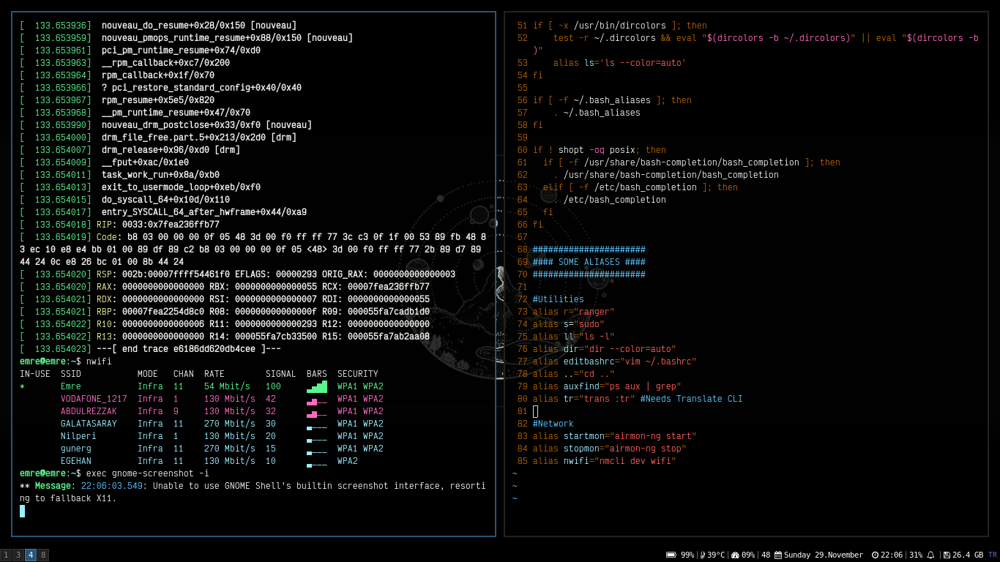

# emrygun Current Dotfiles
> Dotfiles that I'm currently using

## Including

* i3-gaps -> conf
* i3status.conf
* i3blocks.conf
* .bashrc
* URXVT .Xresources

## Meta

Emre – [@emrygun](https://twitter.com/emrygun) – emre6271@gmail.com
You can do whatever you want with these dotfiles.
